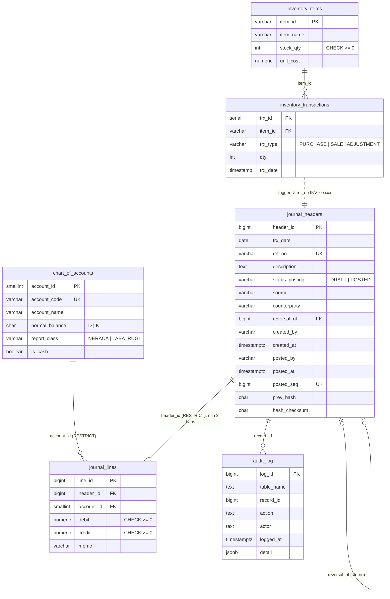

# ERD — General Ledger, Persediaan & Audit Trail

```mermaid
erDiagram
    chart_of_accounts ||--o{ journal_lines : "account_id (RESTRICT)"
    journal_headers   ||--|{ journal_lines : "header_id (RESTRICT), min 2 baris"
    journal_headers   |o--o| journal_headers : "reversal_of (storno)"
    journal_headers   ||--o{ audit_log : "record_id"
    inventory_items   ||--o{ inventory_transactions : "item_id"
    inventory_transactions ||..|| journal_headers : "trigger -> ref_no INV-xxxxxx"

    chart_of_accounts {
        smallint account_id PK
        varchar account_code UK
        varchar account_name
        char normal_balance "D | K"
        varchar report_class "NERACA | LABA_RUGI"
        boolean is_cash
    }
    journal_headers {
        bigint header_id PK
        date trx_date
        varchar ref_no UK
        text description
        varchar status_posting "DRAFT | POSTED"
        varchar source
        varchar counterparty
        bigint reversal_of FK
        varchar created_by
        timestamptz created_at
        varchar posted_by
        timestamptz posted_at
        bigint posted_seq UK
        char prev_hash
        char hash_checksum
    }
    journal_lines {
        bigint line_id PK
        bigint header_id FK
        smallint account_id FK
        numeric debit "CHECK >= 0"
        numeric credit "CHECK >= 0"
        varchar memo
    }
    audit_log {
        bigint log_id PK
        text table_name
        bigint record_id
        text action
        text actor
        timestamptz logged_at
        jsonb detail
    }
    inventory_items {
        varchar item_id PK
        varchar item_name
        int stock_qty "CHECK >= 0"
        numeric unit_cost
    }
    inventory_transactions {
        serial trx_id PK
        varchar item_id FK
        varchar trx_type "PURCHASE | SALE | ADJUSTMENT"
        int qty
        timestamp trx_date
    }
```
